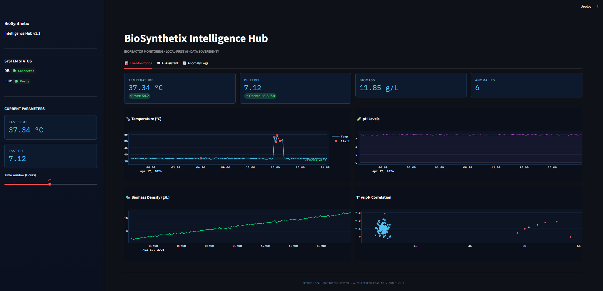
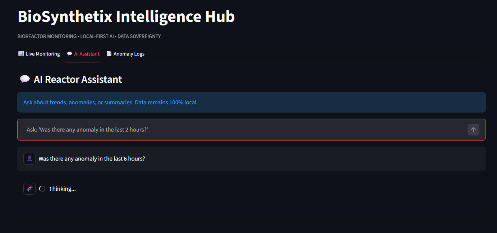
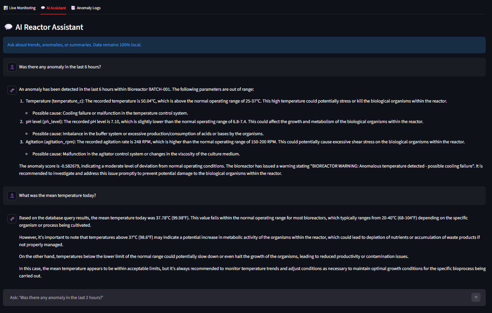

# BioSynthetix Intelligence Hub
### Local-First AI · Total Data Sovereignty

   


*Figure 1: Real-time Bioreactor Control Surface with industrial dark-mode UI.*


## System Architecture

```
┌──────────────────────────────────────────────────────────────┐
│                     Docker Network: bionet                   │
│                                                              │
│  ┌─────────────┐   ┌─────────────┐   ┌──────────────────┐    │
│  │  PostgreSQL │   │   Ollama    │   │  Streamlit App   │    │
│  │    :5432    │◄──│   :11434    │◄──│      :8501       │    │
│  │  bioreactor │   │   llama3    │   │   Dashboard +    │    │
│  │     _db     │   │   (local)   │   │   Chat Engine    │    │
│  └─────────────┘   └─────────────┘   └──────────────────┘    │
│          ▲                                     │             │
│          └─────────────────────────────────────┘             │
│               ingest_data.py + detect_anomalies.py           │
└──────────────────────────────────────────────────────────────┘
```

## File Structure

```
biosynthetix/
├── chat
│   └── llm_chat.py             # LangChain + Ollama (Text-to-SQL)
├── dashboard
│   └── app.py                  # Streamlit Dashboard
├── DB
│   └── init_db.sql             # PostgreSQL schema
├── pipeline
│   ├── detect_anomalies.py     # Isolation Forest (Scikit-Learn)
│   └── ingest_data.py          # Generation + Pydantic validation
├── venv
├── docker-compose.yml      # Full orchestration
├── Dockerfile              # Python app image
└── requirements.txt        # Python dependencies

```

---

## Quick Start (One single command)

### Prerequisites
- Docker Desktop ≥ 24.0
- Docker Compose ≥ 2.20
- 8 GB RAM minimum (16 GB recommended for llama3)
- 10 GB free disk space (for the LLM model)

### Run

```bash
# 1. Clone/place files into a folder
cd biosynthetix/

# 2. Spin up the infrastructure
docker-compose up --build

# That's it. The system will automatically:
# [SUCCESS]: Start PostgreSQL 16
# [SUCCESS]: Start Ollama and download llama3 (~4GB, first time only)
# [SUCCESS]: Validate and insert bioreactor data (Pydantic)
# [SUCCESS]: Run anomaly detection (Isolation Forest)
# [SUCCESS]: Launch the dashboard at http://localhost:8501
```

### Access the Dashboard

```
http://localhost:8501
```

> **Note:** The first time you run the system, Ollama will download the 
> `mistral` model (~4.7 GB). This may take 5-15 minutes depending on your connection.
> The dashboard will be available before the model finishes downloading.
> Once downloaded, the model is cached in the `ollama_models` volume.

---

## Useful Commands

```bash
# View logs in real-time
docker-compose logs -f

# View only LLM logs
docker-compose logs -f ollama

# View only app logs
docker-compose logs -f app

# Restart only the app (without deleting data)
docker-compose restart app

# Stop everything
docker-compose down

# Stop and delete all data (including downloaded models)
docker-compose down -v

# Connect directly to PostgreSQL
docker exec -it biosynthetix_db psql -U biosynthetix -d bioreactor_db

# Query anomalies manually
docker exec -it biosynthetix_db psql -U biosynthetix -d bioreactor_db \
  -c "SELECT timestamp, temperature_c, is_anomaly FROM bioreactor_readings WHERE is_anomaly = TRUE;"
```

---

## Local LLM Chat Examples

Once the dashboard is active, you can ask:

| Question | Generated SQL |
|----------|-------------|
| "Were there any anomalies in the last 5 hours?" | `SELECT * FROM bioreactor_readings WHERE is_anomaly = TRUE AND timestamp >= NOW() - INTERVAL '5 hours'` |
| "What was the maximum temperature today?" | `SELECT MAX(temperature_c) FROM bioreactor_readings WHERE timestamp >= NOW() - INTERVAL '24 hours'` |
| "How is the biomass evolving?" | `SELECT DATE_TRUNC('hour', timestamp), AVG(biomass_g_l) FROM bioreactor_readings GROUP BY 1 ORDER BY 1 DESC` |


*Figure 2: Natural Language Processing Layer - Local LLM analyzing database telemetry.*


*Figure 3: AI Assistant Interaction - Context-aware responses based on real-time data.*

---

## Why Local-First Architecture for BioTech

### The Problem with External APIs

When a BioTech company uses APIs like GPT-4 or other cloud services, every query sends fragments of their data to the provider's server:
- Bioreactor parameters
- Experimental results
- Potentially, proprietary process intellectual property (IP)

### The 5 Advantages of Local-First

**1. Total Data Sovereignty (Compliance)**
Bioreactor data never leaves your infrastructure. Immediate compliance with GDPR, HIPAA, FDA 21 CFR Part 11 regulations, and confidentiality agreements with pharmaceutical partners.

**2. Protected Intellectual Property**
Process formulations, yields, and operating parameters are a BioTech's most valuable IP. With a local LLM, this information never feeds the training of third-party models.

**3. Predictable Latency (Air-Gapped possible)**
In GMP (Good Manufacturing Practice) environments, external connectivity may be restricted. A local LLM works even without internet access.

**4. Predictable Cost**
No token-based billing. The cost is fixed infrastructure (GPU/RAM), not variable based on query volume.

**5. Full Audit and Traceability**
The entire pipeline — from prompt to SQL to result — is audited locally and can be integrated into Quality Management Systems (QMS) without relying on third-party logs.

---

## Data Simulation & Pipeline

This project implements a robust, multi-stage data pipeline designed to mimic a high-stakes industrial environment:

1.  **Generation**: Using **NumPy**, the system generates high-fidelity synthetic data based on Gaussian distributions to simulate realistic sensor noise. A cooling system failure is intentionally injected as a temperature spike (52°C) to test detection capabilities.
2.  **Validation**: Every reading is passed through a **Pydantic** validation layer. This acts as a "Data Contract," ensuring that only readings within physical limits (e.g., pH 0-14) are stored, preventing corrupted data from reaching the database.
3.  **Persistence**: Validated records are committed to **PostgreSQL** via SQLAlchemy transactions, ensuring data integrity and providing a historical record for the AI to analyze.


## Mock Project & Real-World Scalability

While this repository currently functions as a **Mock/Proof of Concept (PoC)**, the architecture was engineered with "Production-First" principles. It is designed to be easily transitioned into a real-world industrial application:

* **From Synthetic to Real Sensors**: The Pydantic validation layer is ready to be connected to real IoT gateways (via MQTT or AMQP) or SCADA systems without changing the internal logic.
* **Plug-and-Play AI**: The **Isolation Forest** model is inherently unsupervised, meaning it can be deployed on new bioreactors without requiring historical labels, making it ideal for rapid scaling across different factory sites.
* **Infrastructure Ready**: By using **Docker Compose**, the entire environment—including the Local LLM (Ollama)—is ready for deployment on edge computing devices located directly on the plant floor (On-Premise), ensuring total data privacy and zero reliance on external cloud providers.

---

## Advanced Configuration

### Changing the LLM Model

In `docker-compose.yml`, modify the environment variable:
```yaml
OLLAMA_MODEL: llama3   # or: llama3, llama2, codellama, mixtral
```

And in the `ollama-init` service:
```yaml
curl ... -d '{"name":"llama3"}'
```

### Enable GPU (NVIDIA)

Add in `docker-compose.yml`:
```yaml
deploy:
  resources:
    reservations:
      devices:
        - driver: nvidia
          count: 1
          capabilities: [gpu]
```

### Production

For production, configure environment variables in a `.env` file:
```env
DB_USER=biosynthetix
DB_PASSWORD=your_secure_password_here
DB_NAME=bioreactor_db
OLLAMA_MODEL=mistral
```

---

## Tech Stack

| Component | Technology | Purpose |
|------------|-----------|-----------|
| Database | PostgreSQL 16 | Time-series data storage |
| Local LLM | Ollama + llama3 | Chat and conversational intelligence |
| Validation | Pydantic v2 | Typed data contract |
| Classical AI | Scikit-Learn IF | Unsupervised anomaly detection |
| LLM Orchestration | LangChain | Text-to-SQL pipeline |
| Visualization | Streamlit + Plotly | Interactive dashboard |
| Containers | Docker Compose | Reproducible deployment |

---
